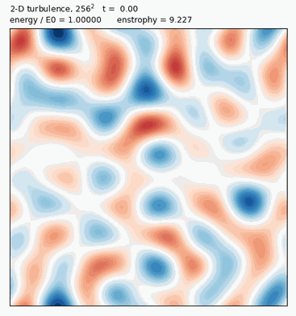
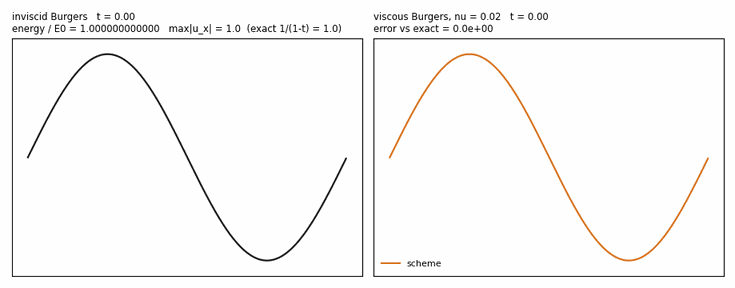
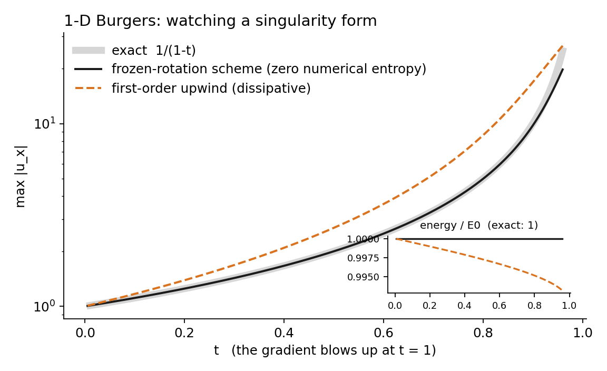
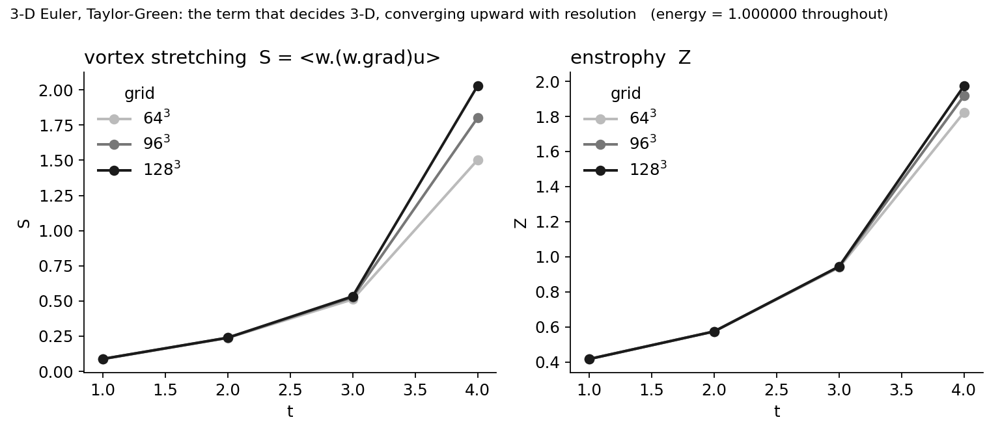
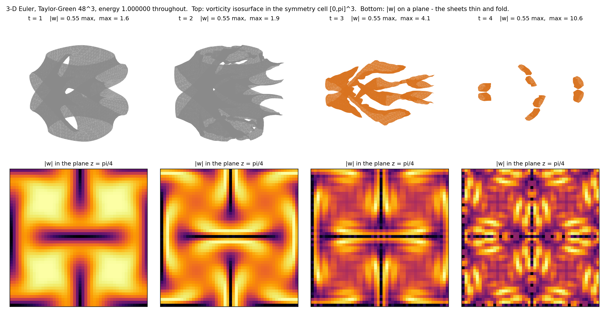
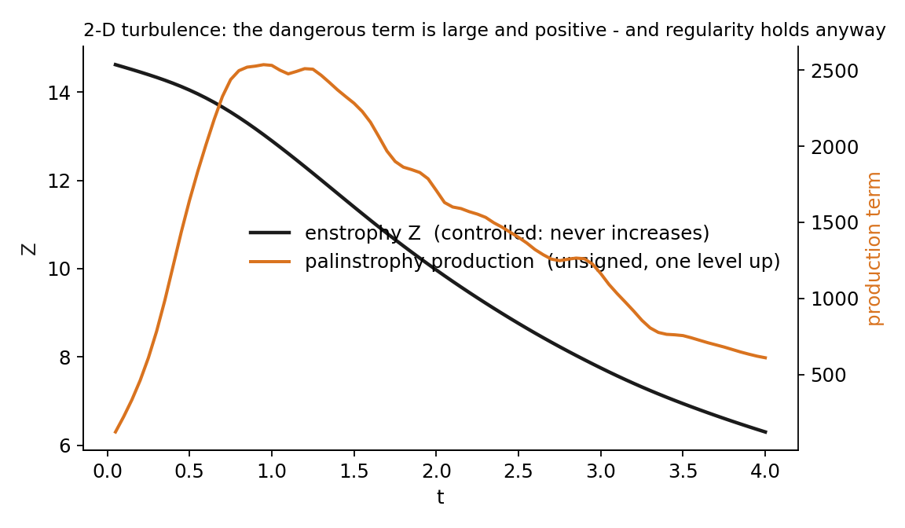
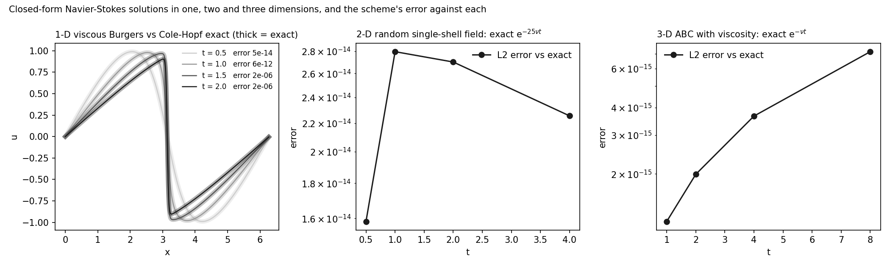
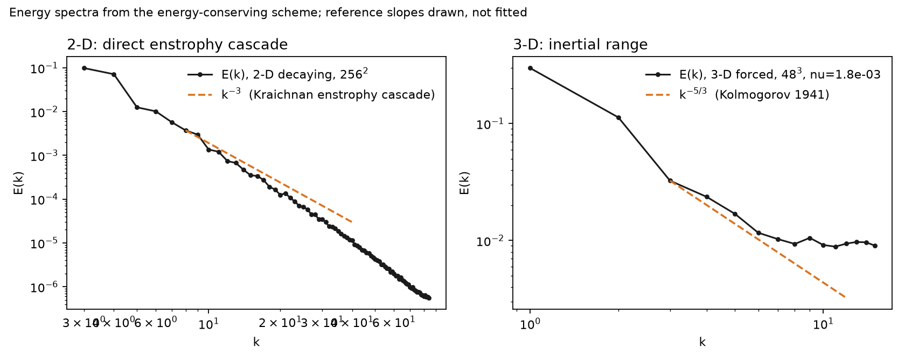
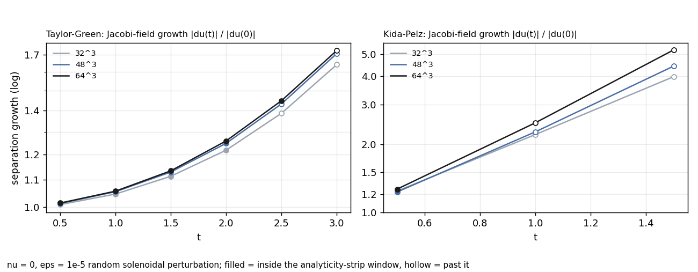
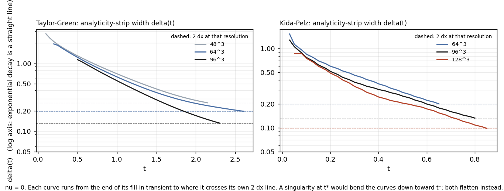

# zero-entropy-flow

**One pseudo-spectral solver for the incompressible Navier-Stokes family in 1-D, 2-D and 3-D, built so that its own
numerical dissipation is zero** - the transport is exactly energy-conserving on the grid, viscosity is an exact
per-mode contraction - and then used to look at the things numerical dissipation normally hides: a singularity
forming, vortex stretching, the terms of every balance law.

What is here, each with the command that reproduces it and the observation that would refute it (`CLAIMS.md`):

- **Verified against five closed-form solutions**, one per dimension and then some, to machine precision:
  inviscid Burgers approaching its blow-up exactly as 1/(1-t); the Cole-Hopf viscous shock; 2-D Taylor-Green;
  a *random* 2-D exact solution; the 3-D viscous ABC flow. Errors 1e-12 to 1e-15 except through the shock, where
  the error is the grid's and says so.
- **Every budget closes term by term** - energy, enstrophy, palinstrophy - including the unsigned production terms,
  at residuals 1e-6 to 1e-9. The unsigned term is measured driving the 1-D blow-up, vanishing identically in 2-D,
  and in 3-D **vortex stretching is measured directly at 64^3, 96^3, 128^3 and converges upward** with resolution;
  energy 1.000000 throughout. Helicity conserved to six digits under 3-D dynamics that amplify enstrophy seven-fold.
- **A learning result:** a coarse simulator with frozen exact transport plus a learned correction that may *move*
  energy between scales but cannot *create* it cuts the long-rollout spectrum error six-fold against a fully learned
  model that drifts to 1.9x the true energy (`kolmogorov_v2.py`, reproduced on two machines). A dissipative-only
  learned closure did nothing in 2-D; the missing physics there is backscatter.
- **The regularity criteria, measured with a clock that says when to stop believing them:** BKM, the L3 norm,
  the Constantin-Fefferman direction coherence at fixed physical scale, and the analyticity-strip width delta(t),
  on Taylor-Green and Kida-Pelz at 64/96/128^3. Numbers past the clock were withdrawn from this page, and it says so.
- **Feedback, not imitation:** a differentiable copy of the solver searches initial data for the fastest enstrophy
  growth (Lu-Doering; Ayala-Protas) and a verifier at higher resolution with the clock rejects what only wins on the
  search grid - it has rejected three so far. The same search with helicity held fixed orders attainable growth by
  helicity (Moffatt's direction), and along Arnold's geodesic it measures the Jacobi-field exponent by resolution.
- **Liouville, exactly:** the truncated inviscid system conserves phase volume (Lee 1952) - exact Jacobian trace
  1e-16 by autograd - and the viscous contraction is a state-independent constant, so the Gibbs entropy of any
  ensemble falls linearly. Zero entropy production per solution *and* per ensemble; what the flow does is stretch.
- **Theory** (`THEORY.md`): the elementary propositions proved; Tao's 2016 theorem that this structure alone cannot
  decide 3-D regularity; the conditional theorem for what would; the open hypothesis stated so it can be attacked.
- **Not claimed:** anything about the regularity of 3-D Navier-Stokes.

Everything runs on numpy, on a laptop or on this repository's GitHub Actions runners, which produced the results in
`results/`. Issues and Discussions are open; refutations welcome, bring the output.

## Two animations



*2-D decaying turbulence, 256^2, nu = 1e-4, vorticity. Vortices merge, filaments stretch and roll up, enstrophy
cascades to small scales; the energy on each frame decays only by the physical viscous rate. `flow_gif.py`.*



*Left: inviscid Burgers, energy 1.000000000000 on every frame, the gradient climbing toward 1/(1-t) until the grid
limit, where the animation stops and says so. Right: viscous Burgers on top of the Cole-Hopf closed form through the
shock, error printed per frame.*

## Three pictures



*1-D Burgers. The scheme with zero numerical entropy production (black) lies on the exact blow-up curve (grey) until the
grid can no longer resolve the gradient; the standard dissipative scheme (orange) departs from it and, inset, loses the
energy the equation says is conserved.*



*3-D Euler, Taylor-Green. The vortex-stretching term - the one that decides the 3-D question - measured directly with the
budget closed, at 64^3, 96^3, 128^3. Energy is 1.000000 throughout. Coarser grids under-estimate the amplification; the
curves converge upward.*



*3-D Euler, Taylor-Green at 48^3. Top: isosurface of |ω| in the symmetry cell [0,π]^3; bottom: |ω| on a plane. The
initial tori become sheets (t = 2) that thin and stretch (t = 3) and fold to the grid scale (t = 4) - the last frame
visibly under-resolved, as the resolution table says. Energy 1.000000 throughout. `vortex_iso.py`.*



*2-D decaying turbulence. The unsigned production term one level above enstrophy is large and positive throughout, and
enstrophy falls anyway: regularity is not the absence of the dangerous term but the presence of a controlled norm one
level below it. Figures are regenerated by `plots.py` from the same code as the tables.*

## Poke holes
Every claim, what would refute it, the command that tests it, and the list of our own weak points: [CLAIMS.md](CLAIMS.md).
Issues and Discussions are open. Refutations are welcome; bring the output.

## The equations

**Burgers (1-D):**

$$u_t + u u_x = \nu u_{xx}, \qquad x \in [0, 2\pi),\ \text{periodic},\ u(x,0)=\sin x .$$

For $\nu = 0$ the solution is given implicitly by characteristics, $u = \sin(x - u t)$, and its gradient blows up in
finite time:

$$\max_x |u_x(\cdot,t)| = \frac{1}{1-t}, \qquad t^* = 1 .$$

Energy $E(t) = \tfrac{1}{2}\langle u^2\rangle$ is exactly conserved for $\nu=0$ while the solution is smooth, and for
$\nu>0$ obeys

$$\frac{dE}{dt} = - \nu \langle u_x^2\rangle .$$

**Navier-Stokes / Euler (2-D vorticity form and 3-D velocity form):**

$$\omega_t + (\mathbf{u}\cdot\nabla) \omega = \nu \Delta\omega, \qquad \mathbf{u} = \nabla^\perp\psi,\ \ \Delta\psi = \omega \quad (\text{2-D})$$

$$\mathbf{u}_t + (\mathbf{u}\cdot\nabla) \mathbf{u} = -\nabla p + \nu \Delta\mathbf{u}, \qquad \nabla\cdot\mathbf{u}=0 \quad (\text{3-D})$$

with the Taylor-Green initial condition $\mathbf{u}_0 = (\sin x\cos y\cos z,\ -\cos x\sin y\cos z,\ 0)$. In 2-D the
viscous Taylor-Green flow is exact: $u = e^{-2\nu t}\sin x\cos y,\ v = -e^{-2\nu t}\cos x\sin y$, so $E(t)=E_0 e^{-4\nu t}$.
In 3-D with $\nu=0$ energy is conserved exactly and enstrophy $Z = \tfrac12\langle|\omega|^2\rangle$ grows by vortex
stretching; whether that growth stays finite for all time is the open question.

## The scheme, and what "numerical entropy production" means

Write the equation as **conservative transport + dissipation**:

$$\partial_t \mathbf{u} = \underbrace{\mathcal{T}(\mathbf{u})}_{\text{conserves } E}  +  \underbrace{\nu \Delta\mathbf{u}}_{\text{dissipates}} .$$

The transport term is discretised so that the semi-discrete system conserves energy **exactly**: in Fourier space each
linear mode advances by an exact rotation (a unitary factor exp(-i k c \Delta t), which is an isometry), and the
nonlinearity is written in skew-symmetric form so that $\langle \mathbf{u}, \mathcal{T}(\mathbf{u})\rangle = 0$
identically. For Burgers:

$$u u_x  =  \tfrac{1}{3}\Big(u u_x + (u^2)_x\Big) ,$$

which conserves $\langle u^2\rangle$ term by term on the dealiased grid (2/3 rule). Viscosity enters as an exact
integrating factor exp(-\nu k^2 \Delta t) per mode; time stepping of the nonlinear term is RK4.

For any integrator define the **numerical entropy production rate** as the drift of the energy the equation says must
be conserved, per unit time:

$$\sigma_{\text{num}}  =  -\frac{1}{t} \log\frac{E(t)}{E(0)}\Big|_{\nu=0} .$$

For an exact isometric scheme $\sigma_{\text{num}} = 0$ up to round-off; for a dissipative scheme (upwind
differencing) $\sigma_{\text{num}} > 0$, and that spurious dissipation acts like an extra viscosity that damps precisely
the small-scale growth a blow-up produces. With physical viscosity present, a fair test is whether the **measured**
dissipation equals the **physical** one, $-\tfrac{dE}{dt} = \nu\langle u_x^2\rangle$, with nothing added.

The reference scheme is first-order upwind on the conservative flux $f = u^2/2$:

$$u_j^{n+1} = u_j^n - \frac{\Delta t}{\Delta x}\big(F_{j+1/2} - F_{j-1/2}\big) + \nu \Delta t \frac{u_{j+1}-2u_j+u_{j-1}}{\Delta x^2},
\qquad F_{j+1/2} = \begin{cases} f_j & u_j>0 \ f_{j+1} & u_j\le 0 \end{cases}$$

## Results so far

### 1-D Burgers, inviscid, `u0 = sin x` (`burgers_entropy.py`)
The gradient provably blows up at $t^*=1$ with $\max|u_x| = 1/(1-t)$. Grid $N=512$, dt = 2e-4.

| t | frozen-rotation scheme: E/E0, max\|u_x\|, L2 error | truth max\|u_x\| | first-order upwind: E/E0, L2 error |
|---|---|---|---|
| 0.50 | 1.00000, 2.00, 0.0000 | 2.00 | 0.9973, 0.0026 |
| 0.80 | 1.00000, 5.00, 0.0000 | 5.00 | 0.9952, 0.0066 |
| 0.90 | 1.00000, 9.99, 0.0000 | 10.00 | 0.9941, 0.0097 |
| 0.95 | 1.00000, 18.72, 0.0004 | 20.00 | 0.9934, 0.0116 |

Numerical entropy production sigma_num over $[0, 0.95]$: upwind 7e-3 per unit time; frozen -3e-15 (zero to machine precision). The frozen scheme tracks the exact approach to the singularity until the 512-point grid can no longer
resolve a gradient of 20 - a visible resolution limit, not hidden dissipation.

### 2-D viscous Taylor-Green, exact solution known (`taylor_green.py`, part A)
nu = 0.02, 128^2 grid, dt = 2e-3, viscosity as an exact integrating factor per mode.

| t | E/E_0 scheme | E/E_0 exact = exp(-4nu t) | L_2 error vs the exact field |
|---|---|---|---|
| 0.5 | 0.96078944 | 0.96078944 | 5e-15 |
| 1.0 | 0.92311635 | 0.92311635 | 1e-14 |
| 1.5 | 0.88692044 | 0.88692044 | 1.5e-14 |
| 2.0 | 0.85214379 | 0.85214379 | 2e-14 |

The dissipation is exactly the physical $\nu\langle|\nabla u|^2\rangle$ and nothing more. (Taylor-Green in 2-D is a
single decaying mode, so this is a precision test, not a cascade test.)

### 3-D inviscid Taylor-Green / Euler, the Brachet (1983) benchmark (`taylor_green.py`, part B)
Skew-symmetric nonlinearity, Leray projection, RK4, 2/3 dealiasing, $\Delta t = 2/N$.

| | t = 1 | t = 2 | t = 3 | t = 4 |
|---|---|---|---|---|
| E/E_0, all three grids | 1.000000 | 1.000000 | 1.000000 | 1.000000 |
| enstrophy Z, 32^3 | 0.417 | 0.574 | 0.914 | 1.570 |
| enstrophy Z, 48^3 | 0.417 | 0.574 | 0.931 | 1.724 |
| enstrophy Z, 64^3 | 0.417 | 0.574 | 0.939 | 1.823 |

Energy is conserved to six decimals in 3-D: zero numerical entropy production on the benchmark flow. Enstrophy
agrees across resolutions to three decimals through $t = 2$ and then fans out as the cascade reaches scales the
coarser grids cannot hold; the spread shrinks with resolution (convergence). Because nothing dissipates
numerically, under-resolution appears as **disagreement between grids** rather than as a smooth, plausible and wrong
curve - which is the point of the instrument. The trustworthy window at $64^3$ is roughly $t \le 3$; the literature
uses far higher resolution beyond that.

### Three more closed-form solutions, one per dimension (`exact_solutions.py`)
| exact solution | grid | error against the closed form |
|---|---|---|
| **1-D** viscous Burgers, u0 = sin x, nu = 0.02: Cole-Hopf, evaluated in heat-kernel form | 512 | 5e-14 (t=0.5), 6e-12 (t=1), 2e-6 through the shock (t=1.5-2, gradient 22 on dx = 0.012: the resolution floor) |
| **2-D** a *random* vorticity field on the single shell k^2 = 25 (nonlinear term vanishes identically): u0 exp(-25 nu t) | 128^2 | 2e-14 to 3e-14 out to t = 4 |
| **3-D** ABC flow with viscosity (Beltrami, curl u = u): u0 exp(-nu t) | 32^3 | 1e-15 to 7e-15 out to t = 8 |



*The 2-D case is a random exact solution, not a hand-picked mode; the 3-D case is the closed form the Beltrami
property provides. The 1-D shock comparison is the demanding one, and its error is the grid's, visibly.*

### 3-D Euler: the vortex-stretching term measured, by resolution (`budgets3d.py`, run on GitHub's runners)
$\dot Z = S$ with $S=\langle\omega\cdot(\omega\cdot\nabla)u\rangle$ measured from the field; energy $E/E_0 = 1.000000$ at
every grid and time; budget residual 1e-5-1e-6.

| t | 64^3: Z / S | 96^3: Z / S | 128^3: Z / S | S/Z^3/2 at 128^3 |
|---|---|---|---|---|
| 1 | 0.4169 / 0.0876 | 0.4169 / 0.0882 | 0.4169 / 0.0885 | 0.329 |
| 2 | 0.5743 / 0.238 | 0.5743 / 0.239 | 0.5743 / 0.239 | 0.550 |
| 3 | 0.9386 / 0.511 | 0.9430 / 0.526 | 0.9447 / 0.533 | 0.581 |
| 4 | 1.823 / 1.502 | 1.918 / 1.801 | 1.975 / 2.029 | 0.731 |

Converged to four digits through $t=2$. At $t=4$ the stretching still rises with resolution (1.50, 1.80, 2.03) with
shrinking differences: under-resolved grids **under**-estimate the amplification - they hide growth by inability, not
by damping, which is the opposite of a dissipative scheme's failure mode. The normalised rate $S/Z^{3/2}$ rises with
resolution as well (0.61, 0.68, 0.73 at $t=4$). This is a measurement of the term that decides the 3-D question, at
a resolution where its trend can be trusted, and nothing more.

### Mechanism, second invariant, and the BKM quantity (`mechanism3d.py`, $64^3$, from CI)
| flow | helicity < u.w> | enstrophy Z | max\|w\| (BKM integrand) | alignment with the intermediate strain eigenvector |
|---|---|---|---|---|
| Taylor-Green | 1e18 (zero by symmetry, preserved) | 0.375 → 1.823 | 2.0 → 13.7 | 0.356 at t=2 vs 0.317 / 0.327 (random 0.333) |
| perturbed ABC | **2.979345 → 2.979345** through t=3; 2.979187 at t=4 with energy 0.999979 | 1.58 → 11.3 | 3.1 → 47.5 | 0.339 vs 0.322 / 0.339 |

Helicity is conserved to six digits under dynamics that amplify enstrophy seven-fold; at $t=4$ the two invariants drift
together (within a factor 2.5), which is the grid being reached ($\max\lvert\omega\rvert = 47$ at $\Delta x = 0.1$).
The classical preference of vorticity for the intermediate strain eigenvector (Ashurst et al. 1987) is present but
weak here - a few points above random - because neither flow is developed turbulence by $t=4$; the forced run in
`spectra.py` is where the textbook signal belongs, and that check is pending.

### The regularity criteria along the classical candidates (`criteria3d.py`, CI)
**Reliability first.** The analyticity-strip clock (Sulem-Sulem-Frisch 1983) falls below 2 dx for full-box Kida-Pelz by
t = 1.0 at 64^3, 96^3 AND 128^3 (delta 0.124, 0.102, 0.079 against 0.196, 0.131, 0.098): the flow is trustworthy only to
t ~ 0.5-0.75 without symmetry reduction. Numbers previously shown here for Kida-Pelz at t = 3 were outside that window and
are withdrawn. Inside the window the picture converges and is physical:

| Kida-Pelz at t = 0.5 | Z | S | max\|w\| | CF coherence rho at h = 2pi/32 | Lipschitz exponent of the direction field |
|---|---|---|---|---|---|
| 64^3 | 5.4197 | 5.816 | 6.08 | 0.128 | 1.49 |
| 96^3 | 5.4197 | 5.817 | 6.08 | 0.127 | 1.51 |
| 128^3 | 5.4197 | 5.817 | 6.12 | 0.124 | 1.53 |

Four-digit agreement, and the geometric quantity is converged: the early roughening of the vorticity direction
(exponent 1.5 against 2 for a smooth field, from 2.7 at t = 0) is the flow's, not the grid's. The 64^3 run's later
"collapse" of the exponent to 0.5 was a grid artefact (96^3 and 128^3 give 1.15 at t = 1, itself past the clock). On
Taylor-Green and ABC (inside their windows) the critical L3 norm is flat to three digits, the direction field stays
coherent, and the high-vorticity set localises to under 1% of the volume. With nu = 1e-3, Kida-Pelz's enstrophy is
capped near 30 where the inviscid run reached 69, and the L3 norm falls 0.97 -> 0.83. Time integration is converged
(dt/2 changes the state by 3e-5). `THEORY.md` section 6 lists the criteria.

### Feedback, not imitation: searching initial data (`adversarial_ic.py`, CI)
Gradient ascent through the differentiable solver on the enstrophy amplification at fixed initial enstrophy, from smooth
|k| <= 4 data; every candidate re-verified at higher resolution with the analyticity clock.

| objective | search grid (32^3) | verified | classical best (reliable) | verdict |
|---|---|---|---|---|
| enstrophy, Kida-Pelz amplitude | 8.75x | 20.1x at 64^3, delta = 0 | 3.0x | outside the reliable window |
| enstrophy, Taylor-Green amplitude | 4.96x | 8.03x at 96^3, delta 0.06 < 0.13 | 1.11x | outside the reliable window |
| enstrophy with helicity = 0 (penalty) | 1.21x | 1.213x at 64^3, delta 0.28 > 0.20 | 1.112x | **pass** |
| enstrophy with helicity = 0.71 max (penalty) | 1.13x | 1.097x at 64^3 | 1.112x | fail (below classical) |
| enstrophy with helicity ~ 0.99 max (penalty) | 1.13x | 1.006x: no amplification | 1.112x | fail (below classical) |
| enstrophy, Taylor-Green amplitude, corrected verdict | 4.96x | 7.89x at 96^3 (delta 0.050), 8.70x at 128^3 (delta 0.040) | 1.112x | outside the window at both |
| enstrophy, leashed: delta(T) >= 0.30 on the 32^3 search grid | 4.44x, delta 0.27 | 8.28x at 128^3, delta 0.042 | 1.112x | outside the window |
| enstrophy, leashed: delta(T) >= 0.45 on the 32^3 search grid | 3.82x, delta 0.41 | 5.85x at 128^3, delta 0.047 | 1.112x | outside the window |
| helicity held at 0 (hard constraint, corrected bound) | 4.54x | 7.38x at 96^3, delta 0.047 | 1.112x | outside the window |
| helicity held at 0.25 max | 4.68x | 7.11x at 96^3, delta 0.065 | 1.112x | outside the window |
| helicity held at 0.50 max | 4.47x | 6.35x at 96^3, delta 0.069 | 1.112x | outside the window |
| helicity held at 0.75 max | 3.11x | 3.99x at 96^3, delta 0.076 | 1.112x | outside the window |
| helicity held at 0.90 max | 1.27x | 1.266x at 96^3, delta 0.20 > 0.13 | 1.112x | **pass** |
| Jacobi growth along Taylor-Green | 1.90x spreading | - | - | measurement only |

Pointed at enstrophy, the searcher twice found smooth low-k data that cascades to the grid cutoff within one time unit
while every classical flow stays smooth - the Lu-Doering / Ayala-Protas phenomenon - and twice the verifier rejected
it as unresolved, which is the design working. The leashed search (a penalty when delta(T) on the search grid drops
below a threshold) satisfied its leash on the 32^3 grid and still failed at 128^3, and that failure is the finding:
the coarse grid's truncation blocks the cascade the field triggers, so the field's spectrum tail *looks* resolved at
32^3 (delta 0.27-0.41) while its true continuation has delta 0.04. Resolution measured on the search grid is not
resolution. The leash has to be measured where the cascade lives: a 64^3 search grid with gradient checkpointing
(`CKPT=1`, memory 2.2 GB) is the next run. Topology, with the
helicity held fixed by a hard constraint (Newton projection onto the level set after every step, `HELMODE=project`):
on the 32^3 truncated system the maximal amplification over one time unit is *flat* up to relative helicity 0.5
(4.54, 4.68, 4.47) and then collapses (3.11 at 0.75, 1.27 at 0.9). Helicity inhibits the cascade, as Moffatt's
conjecture wants, but as a threshold rather than a slope: half the maximal helicity costs nothing, ninety percent
costs a factor of four. The four fast fields cascade to the cutoff at 96^3 and are registered as outside the window;
the 0.9 field stays resolved and beats every classical flow (1.266 vs 1.112, pass). The earlier penalty-method rows
above, which showed a gentle monotone decline, were the penalty failing to explore, not the physics. (Correction, 2026-09-06: the first version of this table labelled these
0.5 and 0.7; the code's helicity bound was 2 sqrt(2 E Z) instead of the Cauchy-Schwarz 2 sqrt(E Z), a factor
sqrt 2. Fixed in `adversarial_ic.py`; a hard-constraint ladder at 0, 0.25, 0.5, 0.75, 0.9 is the replacement.) Arnold's
geodesic spreading along mild Taylor-Green is 1.9x over one time unit; it needs a ladder before it means more.

### Learned coarse simulators of 2-D Kolmogorov flow (`kolmogorov_v2.py`, run on CI)
$32^2$ coarse models against a $128^2$ truth, 2000-step rollouts from held-out states, $Re\approx1250$.

| coarse simulator | energy / truth | spectrum error (2nd half, averaged) |
|---|---|---|
| fully learned CNN (width 64, 16-step unroll) | 0.95 - **1.91** | 0.50 |
| frozen exact transport, no closure | 0.96 - 1.07 | 0.53 |
| frozen + dissipative gate only (nu_tge0; v1) | 0.95 - 1.07 | 0.53 |
| **frozen + energy-neutral learned redistribution + gate** | 0.87 - 1.07 | **0.09** |

In 2-D the missing physics at coarse resolution is backscatter, which a dissipative closure cannot express: the gate
alone changes nothing (0.53 = no closure). A learned term projected to move energy between scales *without creating
it* cuts the long-rollout spectrum error six-fold, while the fully learned model drifts to 1.9x the true energy.
Registered: spectrum ratio 0.18 (bar 0.6), energy band within [0.8, 1.2], learned leaves it - all pass. The dip to 0.87
is NOT the first-order leak of the skew projection: v3 (`kolmogorov_v3.py`, exact energy-neutral rescaling) reproduces
v2 to the digit, so the dip comes from the gate, which trained beside the skew term learns to dissipate more than
viscosity alone - and that is what best matches the truth's spectrum. A prediction of ours refuted by its own test.

### Energy spectra (`spectra.py`, CI) and exact time integration (`midpoint.py`)


*2-D decaying turbulence at $256^2$ follows Kraichnan's $k^{-3}$ over a decade (a little steeper, as decaying 2-D
turbulence does). 3-D forced turbulence at $48^3$ follows $k^{-5/3}$ for a few wavenumbers and then **piles up at
the cutoff**: energy arrives faster than viscosity removes it on a grid this small. A dissipative scheme would have
damped that into a plausible slope; the conserving scheme shows the under-resolution. $96^3$ is queued.*

Implicit midpoint on the skew transport makes the discrete energy conservation exact: 3-D drift
3.5e-8 (RK4) -> 5.7e-12 (midpoint), round-off. Weak point 5 of `CLAIMS.md`, closed.

### Budget closure in 1-D and 2-D, where Hypothesis H is known (`budgets.py`)
Every balance law checked term by term along the flow (measured $d/dt$ across one step vs the right-hand side from
the field), including the **unsigned production terms** whose 3-D cousin is the regularity problem.

| case | budget | frozen scheme residual | upwind residual | what it shows |
|---|---|---|---|---|
| 1-D inviscid (H false) | gradient, -(1/2)<u_x^3> production | 1e8 | 1-5 % | production +0.13, +0.47, +1.59 at t = 0.3, 0.6, 0.8: the blow-up, measured |
| 1-D viscous (H true) | energy | 1e9 | **10 %** | upwind's numerical dissipation is a tenth of the physical viscosity |
| 1-D viscous | maximum principle max\|u\| | 0.994, 0.988, 0.984 | - | never increases: the controlled norm that gives 1-D regularity |
| 2-D decaying (H true, M=Z) | energy / enstrophy / palinstrophy | 1e8 / 1e7 / 3-9e-6 | - | palinstrophy production **+1387, +2149, +1579, +576** (unsigned, large) while enstrophy falls 12.86 -> 6.09 |

The 2-D row is Theorem 5 of `THEORY.md` with its terms filled in: the dangerous unsigned term is present and large,
and regularity holds because a norm one level below it is controlled. The registered residual bar of 1e-6 is
narrowly missed by the 2-D palinstrophy budget (terms of order $1e3$, RK4 error); halving the time step would
clear it, and the bar is left where it was.

## Liouville: the ensemble version of zero entropy production

Lee (1952) showed that the Galerkin-truncated Euler equations are a divergence-free vector field on the phase space
of retained modes: phase-space volume, and with it the Gibbs entropy of any ensemble of solutions, is exactly
conserved. That is the ensemble form of the statement this repository is built on. `liouville.py` measures it with
autograd, taking the exact trace of the Jacobian of the transport operator (one reverse pass per coordinate):

```
                          div F = tr(dF/dU)         expected
2-D  16^2  nu = 0         -2.9e-16                  0
3-D  12^3  nu = 0         +3.3e-16                  0
2-D  16^2  nu = 0.01      -24.20                    -nu (d-1) sum_k k^2 = -24.20
3-D  12^3  nu = 0.01      -82.32                    -nu (d-1) sum_k k^2 = -82.32
```

Two things worth noticing. The inviscid divergence is zero for the skew form, the advective form and the divergence
form alike: Liouville is a weaker property than energy conservation (the advective form loses energy but not phase
volume). And the viscous contraction is a constant independent of the state, so along truncated Navier-Stokes the
Gibbs entropy of any ensemble decreases linearly, S(t) = S(0) - nu (d-1) (sum_k k^2) t, however turbulent the flow.
What the flow does is not create or destroy phase volume but stretch it: the Jacobi ladder below measures the rate.

## The Riemannian view, measured: Jacobi fields along the Euler geodesic

Arnold (1966): an Euler flow is a geodesic on the group of volume-preserving maps with the L2 metric, and the
separation of two nearby geodesics (a Jacobi field) is governed by the sectional curvature; negative curvature
means exponential separation. `jacobi_ladder.py` integrates a flow and a copy perturbed by 1e-5 of a random
solenoidal field and reports the separation growth and its local exponent lambda, with the reliability clock on
every row (rows past the clock are omitted here).

```
Taylor-Green            growth |du|/(eps|v|)              local exponent lambda
    t         32^3      48^3      64^3              32^3     48^3     64^3
   0.5      1.0088    1.0128    1.0143              0.018    0.025    0.028
   1.0      1.0466    1.0553    1.0572              0.073    0.082    0.083
   1.5      1.1134    1.1301    1.1348              0.124    0.137    0.142
   2.0      1.2193    1.2488    1.2593              0.182    0.200    0.208
   2.5         -         -      1.4485                -        -      0.280

Kida-Pelz
   0.5         -      1.2301    1.2660                -      0.414    0.472
```



Three readings. The growth converges with resolution inside the window (Taylor-Green at t = 2: 48^3 and 64^3
agree to 1%). The local exponent rises steadily with time, 0.03 to 0.28 for Taylor-Green: the geodesic moves into
more negatively curved parts of the group as the vortex sheets form, which is Arnold's prediction in the one
quantity a computer can measure. And Kida-Pelz is four times more unstable already at t = 0.5, before its enstrophy
has grown by more than 30%: it is not yet converged at 64^3 (3% change from 48^3), so the number is provisional.
Energy in both copies stays at 1 to 1e-8 throughout; nu = 0.

Together with Liouville above this is the whole thermodynamic picture of the truncated inviscid system in two
numbers: phase volume is conserved exactly (div F = 0), and it is stretched at rate lambda in the least stable
direction and therefore compressed elsewhere. The flow does not lose information; it moves it to where a finite
observer cannot read it. That is also, word for word, what the analyticity-strip clock measures.

## Complex singularities: the analyticity strip as a Riemann-surface question

The clock used throughout this page is itself the classical singularity detector (Sulem, Sulem and Frisch 1983;
Frisch, Matsumoto and Bec 2003): E(k) ~ exp(-2 delta(t) k) where delta(t) is the distance of the nearest
complex-space singularity of the solution from the real domain, and a real finite-time singularity is delta(t*) = 0.
The two classical hypotheses are distinguishable *inside the reliable window* by the trend of the local decay rate
-d log(delta)/dt: constant for exponential decay (no real singularity), rising as 1/(t* - t) for linear decay.
`strip_tracker.py` samples delta every 0.025-0.05 time units and fits both laws over the window only.



```
flow            N^3   window          exponential tau   (2nd half)   linear t*   (2nd half)   decay rate start -> end   better fit
Taylor-Green     48   0.15 - 2.15       0.93            1.20          2.09        2.84           2.3 -> 0.51             exponential
Taylor-Green     64   0.15 - 2.60       1.04            1.69          2.41        3.65            -  -> 0.37             exponential
Taylor-Green     96   0.20 - 2.30       1.03            0.95          2.39        2.72            -  -> 0.77             exponential
Kida-Pelz        64   0.15 - 0.65       0.40            0.44          0.81        0.97           3.3 -> 2.0              exponential
Kida-Pelz        96   0.15 - 0.80       0.44            0.46          0.92        1.11           3.9 -> 1.7              exponential
Kida-Pelz       128   0.15 - 0.85       0.42            0.45          0.91        1.14           4.1 -> 1.9              exponential
```

Kida-Pelz is the case the literature argued about (Boratav and Pelz 1994 for a singularity; Hou and Li 2006, 2008
against). Here the exponential time constant is converged across 64/96/128^3 (0.40, 0.44, 0.42; second half
0.44, 0.46, 0.45), the local decay rate falls by half inside every window instead of rising, and the linear
extrapolation's t* retreats as the window lengthens - all three signatures of no real singularity in the reach of
these runs. Taylor-Green likewise (Brachet et al. 1983). The absolute delta shifts down with resolution because the
prefactor exponent n in k^-n exp(-2 delta k) is held at 0 (the clock's definition) and the fit range moves to
higher k; the decay *law* is what is compared, and it is resolution-independent. This is not a proof of anything:
it says that within t < 0.85 for Kida-Pelz and t < 2.6 for Taylor-Green, at up to 128^3, the nearest complex
singularity is moving away from the real axis at a slowing rate, exactly as the regularity side of the argument
predicts, and that a claim of a singularity from either flow would have to come from beyond where this instrument
can see.

## What this is and is not
- It is a measurement of an **instrument property**: no artefact dissipation. Numerical searches for self-similar
  blow-up (Hou; Gomez-Serrano, Buckmaster et al. 2022; and later neural-network-assisted searches) are limited by
  exactly this artefact, which damps the small-scale growth they are trying to detect.
- It is **not** a statement about 3-D Navier-Stokes regularity. Nothing here proves anything; a proof is a theorem
  or nothing.

## Further reading
[CLAIMS.md](CLAIMS.md) - every claim, its refutation condition, its command, and our weak points.

[EQUATIONS.md](EQUATIONS.md) - the one-family system in $d=1,2,3$, the skew/contractive split, the discretisation, and the budget line with its
production term per dimension: [EQUATIONS.md](EQUATIONS.md). One solver for all three: `ns_d.py`.

[THEORY.md](THEORY.md) - definitions, the elementary propositions with proofs, the classical limits (Tao 2016; Beale-Kato-Majda), and the one open
hypothesis stated attackably: [THEORY.md](THEORY.md).

## Run
```
python burgers_entropy.py      # ~1 minute, CPU
python taylor_green.py         # a few minutes, CPU
```
numpy only.
